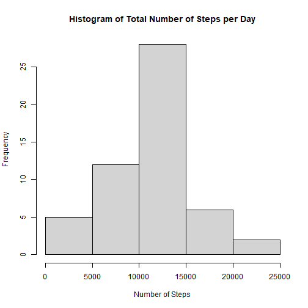
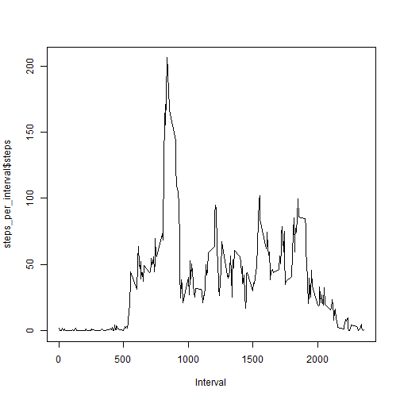
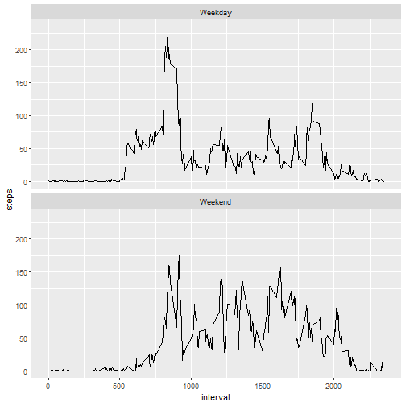

## Loading and preprocessing the data


```r
data <- read.csv("activity.csv")
# summary(data)
data$date <- as.Date(data$date, format="%Y-%m-%d")
```

## What are the total number of steps per day?

```r
steps_per_day <- aggregate(steps ~ date, data, sum)
hist(steps_per_day$steps, xlab = 'Number of Steps', main = 'Histogram of Total Number of Steps per Day')
```



## What is mean total number of steps taken per day?


```r
mean_steps <- mean(steps_per_day$steps)
median_steps <- median(steps_per_day$steps)

print(paste("The mean steps per day is ",mean_steps, " and the median is ", median_steps,".", sep = ""))
```

```
## [1] "The mean steps per day is 10766.1886792453 and the median is 10765."
```

## What is the average daily activity pattern?

```r
steps_per_interval <- aggregate(steps ~ interval, data = data, FUN = mean, na.rm = TRUE)
plot(steps_per_interval$interval,steps_per_interval$steps,xlab = 'Interval',type = "l")
```




## What is the intervale with the greatest average of steps?

```r
interval_with_max_steps <- steps_per_interval[which.max(steps_per_interval[,2]),1]
print(paste("The interval with the most steps is interval ",interval_with_max_steps,'.',sep = ''))
```

```
## [1] "The interval with the most steps is interval 835."
```
## Imputing missing values
### Number of missing values

```r
number_of_missing <- sapply(data, function(x) sum(is.na(x)))
print(number_of_missing)
```

```
##    steps     date interval 
##     2304        0        0
```

### Replace Nan values with the median based on the interval

```r
library(dplyr)
library(tidyr)
clean_data <- data %>% 
  group_by(date) %>% 
  mutate_at(vars(steps), ~replace_na(., median(., na.rm = TRUE)))

summary(clean_data)
```

```
##      steps             date               interval     
##  Min.   :  0.00   Min.   :2012-10-01   Min.   :   0.0  
##  1st Qu.:  0.00   1st Qu.:2012-10-16   1st Qu.: 588.8  
##  Median :  0.00   Median :2012-10-31   Median :1177.5  
##  Mean   : 37.38   Mean   :2012-10-31   Mean   :1177.5  
##  3rd Qu.: 12.00   3rd Qu.:2012-11-15   3rd Qu.:1766.2  
##  Max.   :806.00   Max.   :2012-11-30   Max.   :2355.0  
##  NA's   :2304
```
### Histogram of total steps per day

```r
steps_per_day_clean <- aggregate(steps ~ date, clean_data, sum)
hist(steps_per_day_clean$steps, xlab = 'Number of Steps', main = 'Histogram of Total Number of Steps per Day')
```


### The mean and median of cleaned data

```r
mean_steps_clean <- mean(steps_per_day_clean$steps)
median_steps_clean <- median(steps_per_day_clean$steps)

print(paste("The mean steps per day is ",mean_steps_clean, " and the median is ", median_steps_clean,".", sep = ""))
```

```
## [1] "The mean steps per day is 10766.1886792453 and the median is 10765."
```

## Are there differences in activity patterns between weekdays and weekends?
### Determine if day is on the weekend.

```r
clean_data$day_of_week <- weekdays(clean_data$date, abbreviate = TRUE)
clean_data$day_of_week <- ifelse(clean_data$day_of_week=="Sun"|clean_data$day_of_week=="Sat","Weekend","Weekday")
```
### Plot data


```r
steps_for_day_of_week <- aggregate(steps ~ interval+day_of_week, data = clean_data, FUN = mean, na.rm = TRUE)
day_of_week <- split(clean_data,f=clean_data$day_of_week) 

library(ggplot2)

ggplot(steps_for_day_of_week, aes(x=interval, y=steps)) +
    geom_line() +
    facet_wrap(~ day_of_week, nrow=2, ncol=1)
```



